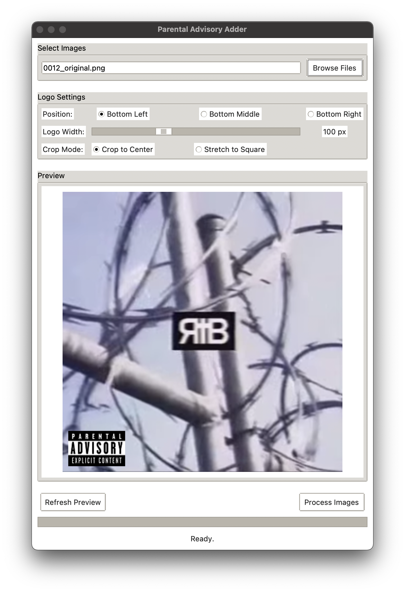

# py-explicit-tag

A python app to add Parental Advisory labels to images

---

<table align="center">
  <tr valign="bottom">
    <td></td>
    <td></td>
  </tr>
  <tr>
    <td colspan="2" align="center">
      <em>Main application window with live preview (left) and example of a processed image (right)</em>
    </td>
  </tr>
</table>

---

## Features

- **Multiple positioning options**: Bottom Left, Bottom Middle, Bottom Right
- **Adjustable logo size**: 50-200 pixels with real-time preview
- **Live preview**: See exactly how the logo will appear before processing
- **Batch processing**: Process multiple images at once with progress tracking
- **Crop modes**: "Crop to Center" & "Stretch to Square"
- **Transparency support**: Preserves transparency in PNG images

## Supported Image Formats

- JPEG (.jpg, .jpeg)
- PNG (.png) - with transparency support
- BMP (.bmp)
- TIFF (.tiff)
- WebP (.webp)

## Requirements

- Python 3.6 or higher
- Pillow (PIL) library
- tkinter (usually included with Python)

## Installation

1. **Clone or download** this repository
2. **Install dependencies**:
   ```bash
   pip install -r requirements.txt
   ```
   Or install Pillow directly:
   ```bash
   pip install Pillow
   ```

## Usage

1. **Run the application**:
   ```bash
   python3 adder.py
   ```

2. **Select images**: Click "Browse Files" to select one or more image files

3. **Configure settings**:
   - **Position**: Choose Bottom Left, Bottom Middle, or Bottom Right
   - **Logo Width**: Adjust size using the slider (50-200 pixels)
   **Crop Mode**: 
     - "Crop to Center": Crops image to square from center
     - "Stretch to Square": Stretches image to square

## 📁 File Structure

```
parental-advisory-adder/
├── adder.py                    # Main application
├── parental.png                # Parental advisory logo
├── requirements.txt            # Python dependencies
└── README.md                   # Ts
```

## How It Works

- **Original files are never modified** - new files are created with "_modified" suffix
- **Transparency is preserved** - PNG images with transparency remain transparent
