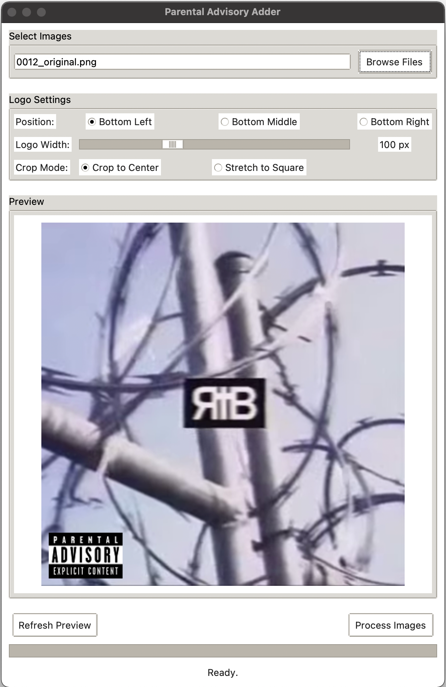

# py-explicit-tag

A python app to batch add Parental Advisory labels to images

---

<table align="center">
  <tr valign="bottom">
    <td></td>
    <td></td>
  </tr>
  <tr>
    <td colspan="2" align="center">
      <em>App UI (left) and a processed image (right)</em>
    </td>
  </tr>
</table>

---

## Requirements

- Python 3.6+
- Pillow library

## Installation

1. **Clone or download** this repository
2. **Install dependencies**:
   ```bash
   pip install -r requirements.txt
   ```

## Usage

1. **Run the application**:
   ```bash
   python3 adder.py
   ```